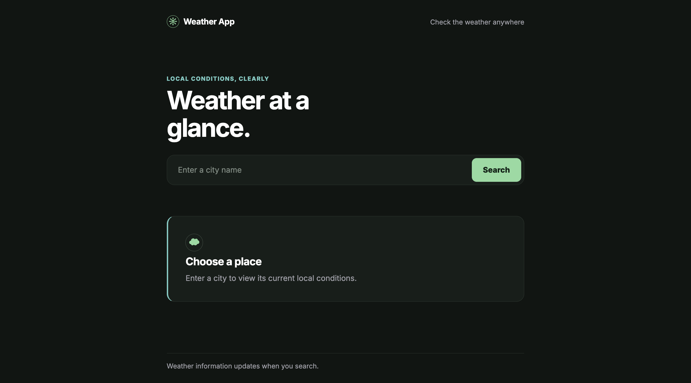

# Weather App

A modern responsive Weather App built with **HTML, CSS, and JavaScript**.

The application allows users to search for cities and view their current weather conditions using data from the **Open-Meteo API**.

## Live Demo

GitHub Pages:
https://8lightsaber8.github.io/weather-app/

## Features

- Search weather by city name
- Display current temperature
- Display daily high and low temperatures
- Display feels-like temperature
- Display humidity
- Display wind speed
- Display visibility
- Display atmospheric pressure
- Weather descriptions based on WMO weather codes
- Dynamic weather icons
- Day and night weather icons
- Loading state while fetching data
- Error handling for:
  - City not found
  - Network errors
  - API errors
  - Invalid API responses
- Responsive design for different screen sizes
- Accessible HTML structure
- Semantic HTML elements
- Reduced-motion support

## Technologies

- HTML5
- CSS3
- JavaScript (ES6+)
- ES Modules
- Fetch API
- Open-Meteo Geocoding API
- Open-Meteo Weather API

## APIs

### Open-Meteo

Weather data is provided by the Open-Meteo API.

- Geocoding API — converts city names into geographic coordinates
- Weather API — provides current and daily weather data

https://open-meteo.com/

## Preview



## Project Structure

```text
Weather-App/
│
├── index.html
├── styles.css
├── README.md
├── .gitignore
├── icons/
│   ├── clear-day.svg
│   ├── clear-night.svg
│   ├── cloudy.svg
│   ├── drizzle.svg
│   ├── fog.svg
│   ├── fog-day.svg
│   ├── fog-night.svg
│   ├── hail.svg
│   ├── overcast.svg
│   ├── partly-cloudy-day.svg
│   ├── partly-cloudy-night.svg
│   ├── rain.svg
│   ├── show.svg
│   ├── sleet.svg
│   ├── thunderstorms.svg
│   ├── thunderstorms-extreme.svg
│   └── wind.svg
│
├──js/
│  ├── main.js
│  ├── api.js
│  ├── constants.js
│  ├── dom.js
│  ├── errors.js
│  ├── events.js
│  ├── render.js
│  └── state.js
│
└──assets/
   ├── screenshot.png
```

## How to Run

1. Clone the repository:

```bash
git clone https://github.com/8lightsaber8/weather-app.git
```

2. Open the project folder:

cd weather-app

3. Open index.html in your browser.
   No additional installation or dependencies are required.

## Author

Created by **Danylo Nykytenko**
